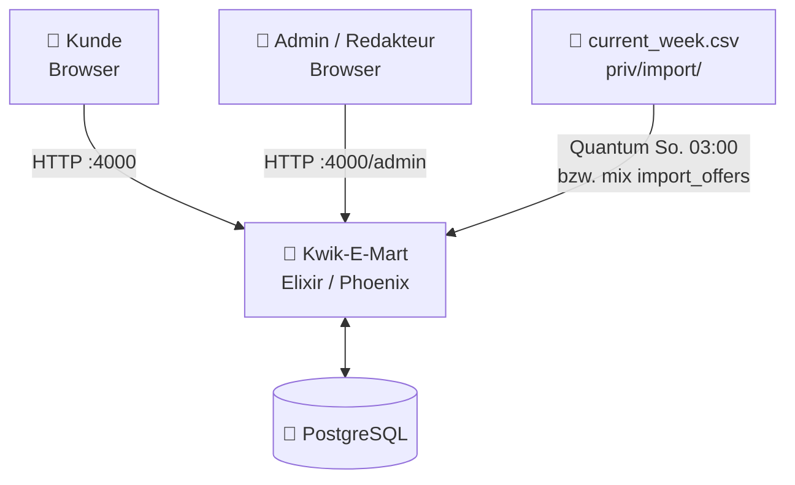
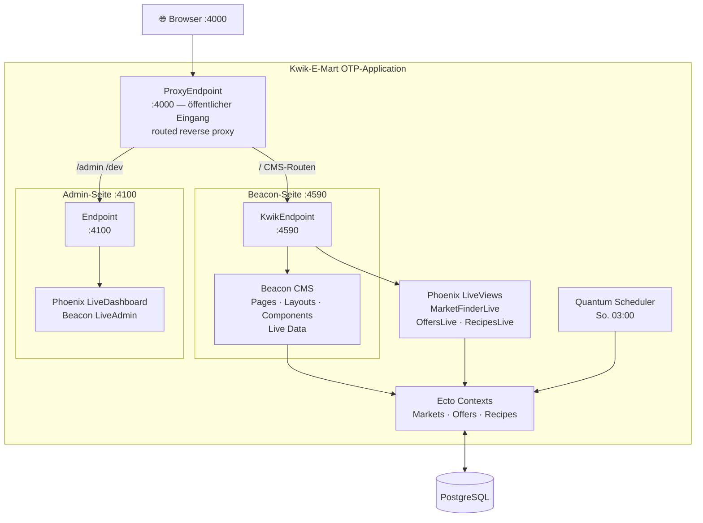
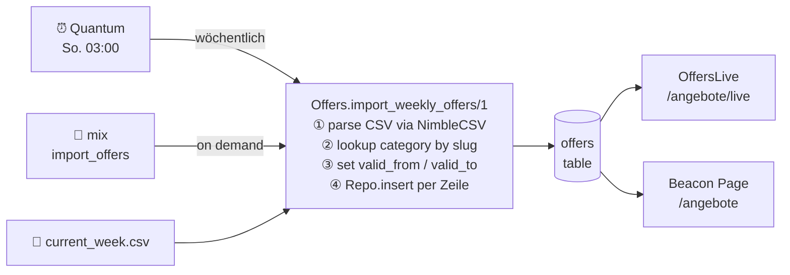
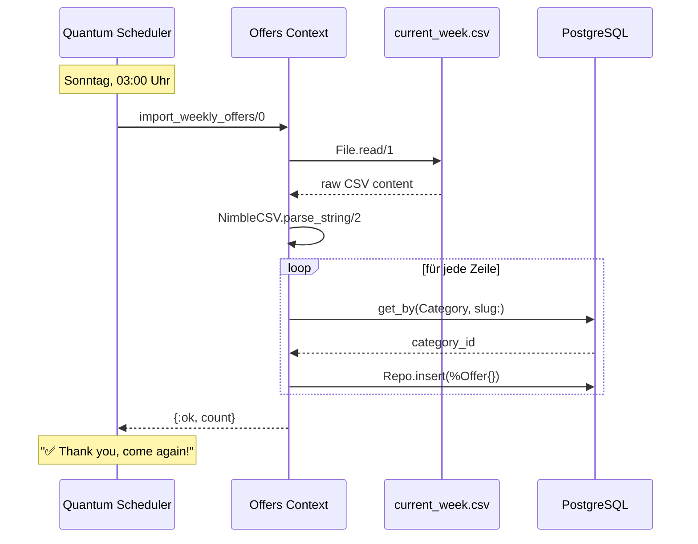

# Kwik-E-Mart – Architecture

> "The neon sign may flicker, but the supervision tree never goes down." — Apu Nahasapeemapetilon (probably)

This document describes the software architecture of Kwik-E-Mart: a Simpsons-themed supermarket webshop built with Elixir, Phoenix, and Beacon CMS.

---

## Table of Contents

- [Project Overview](#project-overview)
- [System Context](#system-context)
- [Container Architecture](#container-architecture)
- [Key Design Decisions](#key-design-decisions)
- [Component Overview](#component-overview)
- [Offers Data Flow](#offers-data-flow)
- [Weekly Import Sequence](#weekly-import-sequence)
- [Deployment & Infrastructure](#deployment--infrastructure)
- [Future Extensions](#future-extensions)

---

## Project Overview

Kwik-E-Mart is a technical reference project demonstrating a production-grade Elixir/Phoenix webshop architecture. It combines a headless CMS (Beacon) for content-managed pages with custom Phoenix LiveViews for highly interactive features, all behind a single public-facing reverse proxy endpoint.

**Goals:**
- Demonstrate Beacon CMS integration in a non-trivial Phoenix app
- Show clean Context-based domain separation (Markets, Offers, Recipes)
- Provide a realistic multi-endpoint Beacon setup as a reference
- Keep the codebase minimal, tested, and understandable

**Tech stack:**

| Layer | Technology |
|-------|-----------|
| Language | Elixir 1.18 (OTP 27) |
| Web framework | Phoenix 1.7 |
| Realtime UI | Phoenix LiveView 1.0 |
| CMS | Beacon 0.5 + Beacon LiveAdmin 0.4 |
| Database | PostgreSQL 16 via Ecto 3 |
| CSS | Tailwind CSS 3 |
| HTTP server | Bandit |
| Scheduler | Quantum 3.5 |
| Cache | Cachex 3.6 (ETS-backed, In-Process) |
| CSV parsing | NimbleCSV 1.3 |
| Dev environment | Devbox (Nix) + Docker |

---

## System Context

Who interacts with the system and how:



**Actors:**
- **Kunde** — browses offers, recipes, and finds local stores via the public site
- **Admin / Redakteur** — manages CMS pages, layouts, and components via Beacon LiveAdmin
- **CSV Import** — weekly offer data placed in `priv/import/current_week.csv`, picked up automatically every Sunday at 03:00 by the Quantum scheduler or triggered manually via `mix kwik_e_mart.import_offers`

---

## Container Architecture

Beacon CMS requires two separate Phoenix endpoints: one internal endpoint that owns the CMS site, and a reverse proxy that bundles all traffic for the outside world. This leads to the three-endpoint model:



### Endpoint Responsibilities

| Endpoint | Port | Responsibility |
|----------|------|----------------|
| `ProxyEndpoint` | 4000 | Single public entry point. Forwards all traffic to the correct internal endpoint via `Plug.Proxy`. Holds the LiveView socket. |
| `KwikEndpoint` | 4590 | Owns the Beacon CMS site `:kwik`. Serves all CMS pages, layouts, and custom LiveViews (`/markt-waehlen`, `/angebote/live`, `/rezepte/live`). |
| `Endpoint` | 4100 | Standard Phoenix endpoint for `/admin` (Beacon LiveAdmin with Basic Auth) and `/dev` (LiveDashboard, Mailbox). Not exposed publicly in production. |

### Why Three Endpoints?

Beacon CMS manages its own routing and live session state. It must own its endpoint to correctly resolve page paths, layouts, and component hooks. A single endpoint would force Beacon and the regular Phoenix router into a conflict over route ownership and LiveView socket handling. The proxy pattern solves this cleanly: one public port, two internal concerns, zero routing conflicts.

---

## Key Design Decisions

### Beacon CMS for Content Pages

Static and semi-static pages (homepage, category landing pages) are managed through Beacon. This allows non-technical editors to update content, hero banners, and promotions without a code deploy. Custom LiveViews handle only genuinely interactive features that Beacon pages cannot express.

### Phoenix LiveView for Interactive Features

Three features require real-time interactivity that goes beyond what a CMS page can provide:

- **MarketFinderLive** — live text search with debounce, browser Geolocation API integration via JS hook, session-based market selection
- **OffersLive** — category filter with `push_patch` (no full page reload), market-scoped offer list
- **RecipesLive** — combined seasonal toggle + category + tag filter

All three LiveViews use `push_patch` for filter state so the URL stays shareable and browser back/forward works correctly.

### Context-Based Domain Separation

The business logic lives in three Ecto contexts with no cross-context Repo calls:

```
KwikEMart.Markets   — market search, geolocation (Haversine), CRUD
KwikEMart.Offers    — offer filtering, CSV import, category lookup
KwikEMart.Recipes   — recipe filtering, seasonal logic, tag aggregation
```

The shared `categories` table is owned by `KwikEMart.Offers` (it existed first) but the `type` column (`"offer"` | `"recipe"`) separates concerns at the data level without requiring a second table or a separate context.

### Quantum over Oban for the Weekly Scheduler

A single weekly cron job does not justify Oban's operational overhead (database migration for `oban_jobs`, persistent job queue, polling). Quantum runs in-process, requires no database schema, and is configured in five lines. The weekly offer import is idempotent and low-stakes — if it misses a run, `mix kwik_e_mart.import_offers` recovers it in seconds.

---

## Component Overview

### Ecto Contexts

```
KwikEMart.Markets
├── create_market/1, get_market/1, get_market!/1
├── search_markets/1          — full-text search (name, city, zip)
└── find_nearby_markets/3     — Haversine formula, default radius 25 km

KwikEMart.Offers
├── list_offers/1             — date-filtered, market/category/superknueller opts
├── list_featured_offers/1    — discount_percent >= 25, limited
├── import_weekly_offers/1    — CSV → DB (NimbleCSV, category slug lookup)
└── list_categories/1         — by type ("offer" | "recipe")

KwikEMart.Recipes
├── list_recipes/1            — seasonal, category_id, tag filters
├── list_seasonal_recipes/0
└── list_all_tags/0           — for tag filter UI
```

### LiveViews

| Module | Route | Key Events |
|--------|-------|-----------|
| `MarketFinderLive` | `/markt-waehlen` | `search`, `select_market`, `use_location` |
| `OffersLive` | `/angebote/live` | `filter_category`, `toggle_superknueller`, `reset_filter` |
| `RecipesLive` | `/rezepte/live` | `toggle_seasonal`, `filter_category`, `reset_filter` |

### Beacon CMS Site `:kwik`

| Concept | Purpose |
|---------|---------|
| Layout `Kwik-E-Mart Standard` | Base HTML with nav and footer |
| Page `/` | Homepage: hero carousel, offer teasers, recipe teasers |
| Live Data | Injects DB data (featured offers, seasonal recipes) into CMS pages |

---

## Offers Data Flow

From CSV file to rendered UI:



**Expiry strategy:** Old offers are never explicitly deleted. `list_offers/1` always filters by `valid_from <= today AND valid_to >= today`. Expired offers become invisible automatically — no cleanup job needed.

**CSV column structure:**

```
title,description,price,original_price,discount_percent,category_slug,featured,image_url
```

- `valid_from` / `valid_to` are calculated by the importer (today + 6 days), not read from CSV
- `market_id` is optional — offers without a market are visible across all markets
- Unknown `category_slug` values produce a warning log, not a failure

---

## Weekly Import Sequence



---

## Deployment & Infrastructure

### Port Layout

| Port | Service | Public? |
|------|---------|---------|
| 4000 | `ProxyEndpoint` — public ingress | ✅ Yes |
| 4590 | `KwikEndpoint` — Beacon CMS | ❌ Internal only |
| 4100 | `Endpoint` — Admin/Dashboard | ❌ Internal only |
| 5433 | PostgreSQL (Docker host mapping) | ❌ Internal only |

In production, only port 4000 is exposed. A reverse proxy (nginx, Fly.io, etc.) terminates TLS and forwards to 4000.

### Docker

```
kwik-e-mart/
├── kwik_e_mart/Dockerfile          # Multi-stage: build → runtime
├── docker-compose.yml              # Dev: app + PostgreSQL
└── docker-compose.prod.yml         # Prod: app + PostgreSQL + env vars
```

The multi-stage Dockerfile builds assets in the `build` stage (Node.js + mix) and produces a minimal runtime image with only the compiled release.

### Environment Variables

| Variable | Required in Prod | Purpose |
|----------|-----------------|---------|
| `DATABASE_URL` | ✅ | PostgreSQL connection string |
| `SECRET_KEY_BASE` | ✅ | Phoenix session signing (min. 64 chars) |
| `ADMIN_USERNAME` | ✅ | Beacon LiveAdmin Basic Auth (Pflichtfeld in docker-compose.prod.yml) |
| `ADMIN_PASSWORD` | ✅ | Beacon LiveAdmin Basic Auth (Pflichtfeld in docker-compose.prod.yml) |
| `PHX_HOST` | ✅ | Public hostname for URL generation |
| `PORT` | optional | HTTP port, default 4000 |

### OTP Supervision Tree

```
KwikEMart.Supervisor (one_for_one)
├── KwikEMartWeb.Telemetry
├── Cachex (:kwik_cache)           (ETS-backed, In-Process)
├── KwikEMart.Repo
├── DNSCluster
├── Beacon (site: :kwik)
├── Phoenix.PubSub
├── Finch
├── KwikEMartWeb.KwikEndpoint      (:4590)
├── KwikEMartWeb.Endpoint          (:4100)
├── KwikEMartWeb.ProxyEndpoint     (:4000)
└── KwikEMart.Scheduler            (Quantum)
```

`KwikEndpoint` starts before `ProxyEndpoint` so Beacon is fully booted before the first public request arrives.

---

## Caching Strategy

`KwikEMart.Cache` wraps Cachex (:kwik_cache) with typed fetch helpers:

| Funktion | Cache-Key | TTL | Invalidierung |
|----------|-----------|-----|---------------|
| `list_offers/1` | `{:offers, hash(opts)}` | 5 min | `create/update/delete_offer`, `import_weekly_offers` |
| `list_featured_offers/1` | `{:offers, :featured, limit}` | 5 min | wie oben |
| `list_recipes/1` | `{:recipes, hash(opts)}` | 5 min | `create/update/delete_recipe` |
| `list_all_tags/0` | `{:recipes, :tags}` | 5 min | wie oben |
| `list_categories/1` | `{:categories, type}` | 1 h | — (Categories ändern sich selten) |

Im Test-Env ist der Cache deaktiviert (`config :kwik_e_mart, :cache_enabled, false`), um stale-Data zwischen Tests zu verhindern.

---

## Future Extensions

| Feature | Approach | Notes |
|---------|----------|-------|
| User authentication | `mix phx.gen.auth` | Generates clean, auditable auth code directly into the project |
| Shopping cart | Session-based LiveView assigns | No DB needed for MVP; upgrade to DB-backed if persistence required |
| Product catalog | New `KwikEMart.Products` context | Separate from `Offers` — products are permanent, offers are time-bound |
| CI/CD | GitHub Actions | `mix test` + `mix format --check` + optional Fly.io deploy |
| Error tracking | Sentry via `sentry` hex package | Add to `config/prod.exs`, instrument `KwikEMart.Application` |
| Rate limiting | `plug_attack` | Protect market search and import endpoints |
